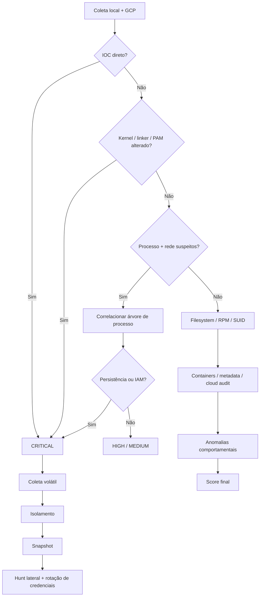
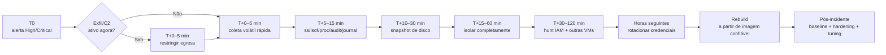

# Heurísticas e sinais de comprometimento de VMs para uma CLI de detecção

## Resumo executivo

Uma CLI de detecção de comprometimento de VMs deve ser construída como um **motor de correlação de evidências**, e não como um “scanner de malware”. A razão é operacional: adversários modernos podem usar binários inéditos, ferramentas legítimas, credenciais válidas, persistência em `cron`/`systemd`, execução somente em memória, `LD_PRELOAD`, módulos de kernel, APIs de cloud e canais C2 sobre protocolos comuns. O MITRE ATT&CK documenta explicitamente técnicas de persistência por cron e systemd, sequestro do dynamic linker, módulos de kernel, PAM, metadata APIs, contas cloud e escape de containers. Mandiant, em investigações recentes do BRICKSTORM, também enfatiza que hunting baseado em TTPs é necessário quando IOCs atômicos deixam de ser reutilizados pelo adversário. citeturn17search1turn17search2turn18view0turn16search0turn20search3

A CLI deveria, portanto, responder a três perguntas diferentes:

1. **Existe evidência direta de comprometimento?** Ex.: domínio/hash conhecido, processo executando de `memfd`, biblioteca desconhecida em `/etc/ld.so.preload`, módulo de kernel anômalo, persistência apontando para `/tmp`, mudança IAM não autorizada.
2. **Existe comportamento fortemente compatível com pós-exploração?** Ex.: shell gerada por processo web, conexões externas periódicas de um processo inesperado, enumeração de metadata, criação de SSH key, scanning east-west.
3. **O host divergiu de uma baseline confiável?** Ex.: `sshd`, `glibc`, `sudo`, PAM, systemd ou kernel com checksum inesperado; nova unit; novo SUID; nova chave SSH; novo módulo; mudança de service account.

Esse desenho segue a recomendação da CISA de combinar múltiplas abordagens técnicas durante hunting e remediation, em vez de depender de um único IOC ou produto. Para sistemas cujo nível de privilégio ou kernel possa ter sido comprometido, a investigação no próprio host não deve ser tratada como prova de integridade: um LKM malicioso pode ocultar processos, arquivos e atividade de rede, e técnicas de dynamic-linker hijacking podem adulterar o que ferramentas userland enxergam. citeturn20search1turn16search0turn18view0

**Minha recomendação de arquitetura é usar um score correlacionado**, mantendo separados `confidence` e `severity`. Uma conexão externa isolada é geralmente baixa/média confiança; uma conexão externa de um ELF em `/dev/shm`, persistido por systemd, com executável apagado e DNS para um IOC conhecido é evidência de altíssima confiança.

Uma política inicial razoável para a CLI seria:

| Score proposto | Classificação | Comportamento padrão |
|---:|---|---|
| `>= 100` | Critical | gerar incidente; opção de isolamento automático previamente autorizada |
| `70–99` | High | resposta humana imediata; captura forense |
| `40–69` | Medium | investigar e correlacionar |
| `20–39` | Low | registrar/baseline |
| `< 20` | Informational | telemetria |

Esses valores **não são thresholds publicados por CISA/MITRE/Google**; são uma proposta de engenharia para começar em `observe`, calibrar contra o ambiente e posteriormente promover apenas sinais altamente confiáveis para `enforce`.

A ordem mais produtiva de triagem é:

**IOC direto / IAM perigoso → kernel e linker → processo + rede → persistência → integridade do filesystem/packages → credenciais/identidade → containers → anomalias comportamentais de rede.**

Essa ordem privilegia sinais com maior razão sinal/ruído. Elastic, por exemplo, mantém regras específicas para criação de systemd, timers, modificações de cron, conexões suspeitas iniciadas por filhos de `sshd`, módulos de kernel tainted e persistências menos óbvias; isso reforça a utilidade de dividir a CLI por famílias de comportamento. citeturn20search2



## Arquitetura de detecção e modelo de risco

A CLI deve enxergar a VM por **views independentes**. Isso é particularmente importante após possível comprometimento root: confiar apenas em `ps`, apenas em `ss` ou apenas em `ls` cria uma dependência exatamente das interfaces que um rootkit pode manipular. MITRE registra que LKMs maliciosos podem esconder processos, arquivos e tráfego de rede; dynamic linker hijacking pode interceptar funções como `execve` e `readdir`; e pesquisas da Elastic mostram malware Linux real executando payloads via `memfd`, usando LKM e componente userland simultaneamente. citeturn16search0turn18view0turn18view1

A arquitetura recomendada é:

| View | Fonte | O que obter |
|---|---|---|
| Processos | `/proc`, `ps`, osquery, audit | PID, PPID, UID, executable, argv, cwd, namespaces, PTY |
| Rede | `ss`, `lsof`, DNS logs, VPC Flow Logs | IP/porta, processo, frequência, duração, bytes |
| Persistência | cron, systemd, PAM, linker, SSH | artefato, timestamp, owner, payload |
| Filesystem | stat, hashes, RPM, SUID/SGID | alterações e divergência de baseline |
| Kernel | `/proc/modules`, sysfs, module signing, audit | módulo, path, taint, eBPF |
| Identidade | local users + Cloud Audit Logs | principal, role, token, service account |
| Cloud | Metadata, SCC, Shielded VM, VPC/DNS logs | alterações externas ao guest |
| Container | Docker/containerd/Kubernetes | privileges, mounts, namespaces, exec |
| Baseline | manifesto assinado | “estado conhecido bom” |

**O princípio central deve ser “cross-view”.** Exemplos:

```text
/proc diz que PID existe
        +
/proc/PID/exe -> /memfd:xyz (deleted)
        +
ss associa PID a 51.x.x.x:443
        +
cron referencia o mesmo usuário
        =
confidence muito maior
```

Outro:

```text
Cloud Audit Logs: setMetadata
        +
metadata atual ganhou ssh-keys
        +
login SSH novo
        =
possível persistência via identidade
```

O próprio Security Command Center possui detecções para alterações suspeitas de SSH keys e diversos comportamentos de service accounts, incluindo concessões de privilégios e impersonation, mostrando que esses eventos devem ser tratados como parte da detecção da VM, não como um domínio separado de “cloud security”. citeturn14search2

**Baseline é tão importante quanto assinatura.** Para cada VM ou classe de VM, salve um manifesto versionado e preferencialmente assinado contendo:

```json
{
  "host_class": "node-api-prod",
  "os": "rocky-9",
  "expected_services": [
    "sshd.service",
    "node-api.service",
    "google-guest-agent.service"
  ],
  "expected_listeners": ["22/tcp", "8080/tcp"],
  "allowed_egress_domains": [
    "api.exemplo.com"
  ],
  "allowed_kernel_modules": [],
  "expected_users": ["root", "node"],
  "expected_suid_hashes": {},
  "critical_file_hashes": {},
  "expected_gcp_service_account": "node-api@project.iam.gserviceaccount.com"
}
```

Isso permite que um evento aparentemente legítimo — por exemplo, uma unit systemd nova — seja promovido para suspeito porque **não pertence ao estado esperado**.

Para rede GCP, VPC Flow Logs é uma fonte excelente, mas não é packet capture: o Google documenta que os pacotes são amostrados e agregados por conexão/5-tuple; a amostragem primária é dinâmica e não é controlável pelo cliente. Portanto, regras como “exatamente cinco conexões” ou “exatamente 123 MB” não devem depender exclusivamente de Flow Logs. Para inspeção de todos os pacotes, o próprio Google recomenda Packet Mirroring. citeturn15search3turn15search7

Isso leva a uma distinção importante:

```text
Host telemetry       -> precisão por processo
VPC Flow Logs        -> visibilidade central / lateral / histórica
Cloud DNS logs       -> nomes consultados
Cloud Audit Logs     -> mudanças de controle e IAM
SCC                  -> detecções cloud correlacionadas
```

Cloud DNS pode registrar queries originadas por VMs e disponibiliza campos como `queryName`, `vmInstanceId` e `vmInstanceName`; existe documentação oficial em português. citeturn14search4turn14search6

## Heurísticas priorizadas por domínio

A tabela abaixo é uma priorização **para uma VM Linux em GCP**, não uma lista de IOCs universais. “Confiança” indica quanto o sinal, sozinho, sugere comprometimento; combinações devem elevar o score.

| Prioridade | Domínio | Heurística | Confiança isolada | Falsos positivos típicos | ATT&CK |
|---|---|---|---|---|---|
| P0 | IOC | hash/domínio/IP malicioso conhecido no contexto | Alta | infraestrutura compartilhada, IOC expirado | varia |
| P0 | Kernel | módulo carregado de path incomum ou desconhecido | Alta | DKMS, drivers, agentes EDR | T1547.006 |
| P0 | Linker | `/etc/ld.so.preload` criado/modificado inesperadamente | Alta | profiling/debugging raro | T1574.006 |
| P0 | PAM | modificação não autorizada em PAM ou módulos | Alta | pacote/update legítimo | T1556.003 |
| P0 | IAM | SSH key/service account/role inesperada | Alta | Terraform/admin autorizado | T1078.004/T1098 |
| P1 | Processo | ELF `memfd` ou executável `(deleted)` + conexão externa | Alta | upgrades/hot reload; runtimes específicos | execução/defense evasion |
| P1 | Processo | shell filha de web/app process | Alta | consoles administrativos legítimos | pós-exploração |
| P1 | Persistência | cron/systemd executando `/tmp`, `/dev/shm`, home oculto | Alta | aplicações muito mal projetadas | T1053.003/T1543.002 |
| P1 | Rede | C2/beacon periódico de processo inesperado | Média/Alta | agentes de monitoramento | T1071 |
| P1 | Cloud | consulta ao Metadata API por processo inesperado | Média/Alta | google agents, cloud-init | T1552.005 |
| P1 | Filesystem | mismatch de checksum em `sshd`, PAM, libc, sudo, ps, ss | Alta | atualização incompleta/customização | defense evasion |
| P1 | Kernel | eBPF load/attach inesperado por usuário/processo | Média/Alta | observabilidade/EDR | rootkit/defense evasion |
| P1 | Container | privileged + host mounts/docker.sock | Média/Alta | CNI/storage/security agents | T1611 |
| P2 | Filesystem | novo SUID/SGID fora do package manager | Alta | pacote legítimo |
| P2 | Persistência | nova authorized key | Média/Alta | operação normal |
| P2 | Rede | scanning east-west | Média | scanner/monitoring |
| P2 | DNS | labels longos/alta entropia/NXDOMAIN anômalo | Média | CDNs, telemetry |
| P2 | IAM | enumeração anormal de IAM/secrets | Média | CI/CD/admin | cloud account discovery |
| P2 | Filesystem | ELF oculto em writable directories | Média | software customizado |
| P3 | Processo | nome mascarado, parent incomum, PTY de service account | Média | wrappers/admin |
| P3 | Rede | grande transferência outbound para destino novo | Média | backup/deploy |
| P3 | Host | login interativo de system user | Média | manutenção excepcional |

**Kernel e execução oculta.** MITRE documenta que LKMs maliciosos podem executar no nível mais privilegiado do sistema e esconder arquivos, processos e tráfego. Em pesquisa original da Elastic sobre PUMAKIT, o malware utilizava executáveis em `memfd`, um loader, LKM e rootkit userland; o estudo mostra explicitamente referências `/memfd:... (deleted)` em `/proc/PID/fd`. Portanto, `memfd` não deve ser marcado automaticamente como malware, mas `memfd + executable + external socket + service account/root` é uma correlação muito forte. citeturn16search0turn18view1

**Dynamic linker.** `LD_PRELOAD` permite carregar objetos compartilhados antes das bibliotecas normais. MITRE documenta o abuso para execução e ocultação de artefatos, incluindo interceptação de funções de libc; alterações inesperadas em `/etc/ld.so.preload`, variáveis `LD_PRELOAD` e `.so` recém-criados em diretórios controlados por usuário são sinais explicitamente recomendados para detecção. citeturn18view0

**PAM.** PAM adulterado é particularmente importante porque pode simultaneamente criar um bypass de autenticação e capturar credenciais. MITRE recomenda correlacionar modificações em `/etc/pam.d/` ou bibliotecas PAM com autenticações incomuns. citeturn17search5

**Cron/systemd.** A mera existência de cron ou units não é suspeita; o sinal é **novidade + origem + payload + contexto**. ATT&CK documenta cron como mecanismo de execução/persistência e systemd services como mecanismo de persistência e possível privilege escalation. citeturn17search14turn17search11

Exemplo de scoring:

```text
nova systemd unit                       +25
ExecStart=/home/node/.config/.x         +30
arquivo ELF sem package owner           +15
processo mantém conexão externa         +30
destino é IOC conhecido                 +70
---------------------------------------------
score                                   170 -> CRITICAL
```

**Processos apagados.** `/proc/PID/exe -> ... (deleted)` sozinho deve ser `medium`, pois atualização de pacotes pode substituir um executável que continua carregado. Torne-o `high` quando coexistir com um dos seguintes: `memfd`, writable path, ausência de package owner, nome mascarado, processo root inesperado ou socket externo.

**PTY anômalo.** Um `/dev/pts/N` não é malicioso: é normal em SSH. O sinal útil é:

```text
service account / daemon
        ↓
processo inesperado
        ↓
shell interativa
        ↓
/dev/pts/*
```

Um shell filho de `nginx`, `httpd`, `php-fpm`, `node`, `java`, `gunicorn`, `uwsgi` ou outro serviço Internet-facing deve receber score alto, especialmente se não houver mecanismo administrativo que justifique isso.

**Metadata API.** ATT&CK classifica o acesso à Cloud Instance Metadata API como T1552.005 porque um adversário presente na VM pode consultá-la para obter informações sensíveis e credenciais; `169.254.169.254` é o endereço link-local amplamente utilizado para esse serviço. Em GCE, processos dentro da VM podem acessar o metadata server, portanto a detecção mais útil é por **processo inesperado**, não pelo endereço isoladamente. citeturn16search2

Exemplo:

```text
google_guest_agent -> metadata        normal
cloud-init          -> metadata        normal

curl                -> metadata        suspeito
wget                -> metadata        suspeito
php-fpm -> curl     -> metadata        muito suspeito
node app -> metadata -> token endpoint depende da aplicação
```

**DNS.** ATT&CK recomenda procurar padrões como volume elevado, subdomínios longos/codificados e infraestrutura conhecida ao detectar C2 sobre DNS. Cloud DNS fornece uma fonte central para isso. citeturn14search6

No ambiente discutido nesta investigação, adicione um IOC local explícito:

```regex
(?i)(^|\.)gs\.thc\.org\.?$
```

e, mais especificamente:

```regex
(?i)^[^.]+\.gs\.thc\.org\.?$
```

Uma query para `*.gs.thc.org` deve ser tratada como **high/critical neste ambiente**, porque decorre do incidente conhecido, mas não deve ser apresentada no produto como heurística universal de comprometimento.

**Rede comportamental.** Recomendo os seguintes thresholds iniciais para `observe`:

| Heurística | Threshold inicial | Confiança | Promoção para High |
|---|---:|---|---|
| TCP externo persistente | mesmo processo/destino observado por `>=15 min` | Média | processo não allowlisted ou writable-path |
| Beacon | `>=5` conexões em `30 min`; mediana do intervalo `30–300 s`; CV `<0,25` | Média | destino novo + processo suspeito |
| Fan-out horizontal | `>=20` IPs distintos em `5 min` | Média | portas administrativas/internas |
| Port scan | `>=50` portas distintas/destino em `5 min` | Média/Alta | processo não scanner |
| DNS NXDOMAIN | `>=50` queries/10 min e `>=50%` NXDOMAIN | Média | labels de alta entropia |
| DNS tunneling | label `>=45 chars`, entropia `>=3,5 bits/char`, `>=20`/5 min ao mesmo domínio-base | Média/Alta | TXT/NULL + bytes elevados |
| Exfil outbound | `>500 MB/15 min` **e** `>10x` mediana histórica | Média/Alta | destino nunca visto |
| Metadata API | `>=1` por `curl/wget/nc` ou processo web não allowlisted | Alta | acesso a endpoint de token |
| East-west recon | `>=20` hosts internos/5 min | Média/Alta | ports `22/2375/3306/5432/6379/9200/27017` |

Esses números são **defaults de bootstrap**, não normas universais. Devem ser recalibrados por classe de workload. Além disso, os thresholds de bytes em VPC Flow Logs precisam tolerar a natureza amostrada e estimada dos registros. citeturn15search3turn15search7

**Filesystem e integridade de pacote.** RPM mantém informações de verificação dos arquivos administrados pelo package manager; `rpm -V` é, portanto, útil para identificar divergências entre arquivos instalados e o estado registrado pelo pacote. O flag `5` no resultado de verificação indica divergência de digest/checksum. Alterações legítimas em arquivos de configuração são comuns, então o resultado deve ser ponderado pelo tipo e path. citeturn6search8turn6search20

Sugestão de pesos:

```text
/etc/ssh/sshd_config alterado            +15
/usr/sbin/sshd checksum alterado         +60
/usr/bin/sudo checksum alterado          +70
glibc shared object alterado             +70
PAM .so alterado                         +90
/bin/ps ou ss alterado                   +70
kernel/module alterado                   +80
```

**Containers.** MITRE recomenda observar privileged containers, bind mounts do host, acesso a `docker.sock`, syscalls como `unshare`/`mount` e execução subsequente no host para identificar escape. CrowdStrike também ressalta que segurança runtime precisa correlacionar atividade do container com a do worker node, porque ambas pertencem à mesma cadeia de comprometimento. citeturn16search1turn19search0turn19search2

**Cloud IAM e control plane.** A CLI deve considerar mudanças cloud tão importantes quanto alterações no guest. Security Command Center possui detectores para grants sensíveis de service accounts, impersonation, mudanças de SSH key e outras anomalias de identidade; a própria resposta recomendada pelo Google para possível comprometimento inclui remoção/rotação da credencial e investigação das ações realizadas. citeturn14search2

Sinais GCP de prioridade alta:

| Evento | Score sugerido |
|---|---:|
| `compute.instances.setMetadata` adicionando SSH/startup behavior fora de change window | +60 |
| `compute.instances.setServiceAccount` inesperado | +70 |
| mudança de `ssh-keys` em VM madura | +70 |
| service account nova no host | +60 |
| `roles/iam.serviceAccountTokenCreator` concedido inesperadamente | +80 |
| criação de SA key não prevista | +80 |
| impersonation administrativa incomum | +80 |
| disk/snapshot/clone inesperado de ativo crítico | +60 |
| firewall aberto para Internet | +70 |
| logging desabilitado ou retention reduzida | +80 |

O SCC inclui, inclusive, detecção específica de “GCE Admin Added SSH Key” para alterações de `ssh-keys` em instâncias já estabelecidas, reforçando o valor deste sinal. citeturn8search22

Finalmente, Shielded VM e integrity monitoring agregam uma visão externa ao guest para aspectos de boot e integridade, útil principalmente quando a ameaça considerada inclui manipulação abaixo do userland. citeturn4search0

## Regras concretas para implementação

A CLI deve coletar dados estruturados primeiro e aplicar regras depois. Evite dezenas de pipelines `grep` diretamente sobre a saída human-readable como mecanismo principal. O ideal é:

```text
collector
   ↓
normalized events
   ↓
rules
   ↓
correlation
   ↓
score
   ↓
alert
```

**Inventário de processos:**

```bash
ps -eo pid,ppid,uid,user,lstart,etime,tty,stat,comm,args --forest
```

Uma view `/proc` é ainda mais útil:

```bash
for p in /proc/[0-9]*; do
    pid="${p##*/}"

    exe="$(readlink "$p/exe" 2>/dev/null || true)"
    cwd="$(readlink "$p/cwd" 2>/dev/null || true)"
    cmd="$(tr '\0' ' ' < "$p/cmdline" 2>/dev/null || true)"

    printf '%s\t%s\t%s\t%s\n' "$pid" "$exe" "$cwd" "$cmd"
done
```

**Execução apagada ou em memória:**

```bash
for exe in /proc/[0-9]*/exe; do
    target="$(readlink "$exe" 2>/dev/null || true)"

    case "$target" in
        *"(deleted)"*|"/memfd:"*)
            printf '%s -> %s\n' "$exe" "$target"
            ;;
    esac
done
```

Regex:

```regex
(?:^/memfd:|\(deleted\)$)
```

Score recomendado:

```text
deleted executable                  30
memfd executable                    45
+ outbound socket                   +30
+ UID 0                             +15
+ process name masquerading         +20
```

A pesquisa do PUMAKIT é um exemplo concreto de malware que usou `memfd_create`, `execveat` e objetos `/memfd:... (deleted)`, embora aplicações legítimas também possam usar memória executável. citeturn18view1

**Sockets:**

```bash
ss -Htanp
ss -Huanp
lsof -nP -iTCP -sTCP:ESTABLISHED
lsof -nP -iUDP
```

Não recomendo detectar “IP público” por uma regex gigante. No código da CLI, use biblioteca de endereços IP:

```python
from ipaddress import ip_address

def is_external(addr: str) -> bool:
    try:
        ip = ip_address(addr)
        return ip.is_global
    except ValueError:
        return False
```

A regra pode ser:

```text
IF socket.state == ESTABLISHED
AND dst.ip.is_global
AND process.path NOT IN network_allowlist
THEN network.unexpected_egress += 25
```

**Writable paths de alto interesse:**

```regex
^/(?:tmp|var/tmp|dev/shm)(?:/|$)
|^/run/user/[^/]+(?:/|$)
|^/home/[^/]+/(?:\.cache|\.config|\.local)(?:/|$)
```

Não é “malware path”; é um modificador de risco.

Exemplo:

```text
/tmp/a.out                       low/medium
/tmp/a.out + executable          medium
/tmp/a.out + systemd             high
/tmp/a.out + systemd + C2        critical
```

**Shell/reverse-shell behavior:**

```regex
(?i)
/dev/(?:tcp|udp)/
|\b(?:bash|sh|dash|zsh)\b[^\n]*\s-i(?:\s|$)
|\bnc(?:at)?\b[^\n]*(?:-e|--exec)\b
|\bsocat\b[^\n]*\bEXEC:
|\bpython[23]?\b[^\n]*(?:socket|pty\.spawn|dup2)
|\bperl\b[^\n]*\bSocket\b
```

A regex isoladamente deve ficar em `medium`; promova quando houver árvore de processo e rede:

```text
php-fpm
  └─ sh
      └─ curl
          └─ external network
```

ou:

```text
node
  └─ bash -i
       ↕ socket externo
```

**PTY inesperado:**

```bash
for p in /proc/[0-9]*; do
    pid="${p##*/}"

    for fd in 0 1 2; do
        target="$(readlink "$p/fd/$fd" 2>/dev/null || true)"
        case "$target" in
            /dev/pts/*)
                printf '%s fd=%s tty=%s\n' "$pid" "$fd" "$target"
                ;;
        esac
    done
done
```

A CLI deveria então verificar:

```text
has_pty
AND (
    owner_is_service_account
    OR parent_is_network_daemon
    OR no_corresponding_expected_login
)
```

**Masquerading de kernel thread:**

Processos kernel reais e processos userspace precisam ser diferenciados usando múltiplas propriedades. Um sinal particularmente útil é um processo que tenta se chamar como `[kworker/...]` mas possui um executável ELF normal em disco ou `memfd`.

Regex do nome:

```regex
^\[(?:kworker|ksoftirqd|migration|rcu|watchdog|kswapd)[^]]*\]$
```

Regra:

```text
kernel_like_comm
AND /proc/PID/exe resolves to userspace executable
=> HIGH
```

**Cron:**

```bash
grep -RInE \
  'curl|wget|base64|nohup|setsid|/dev/(tcp|udp)|/tmp/|/dev/shm/|\.config/' \
  /etc/cron.d /etc/crontab /var/spool/cron 2>/dev/null
```

Payload regex:

```regex
(?i)
(?:curl|wget)\b.*(?:\||&&|;)\s*(?:ba)?sh\b
|base64\s+(?:-d|--decode)
|\bnohup\b
|\bsetsid\b
|/dev/(?:tcp|udp)/
|/(?:tmp|var/tmp|dev/shm)/
|@reboot
```

ATT&CK mapeia diretamente esse tipo de mecanismo a Cron/T1053.003. citeturn17search14

**Systemd:**

```bash
systemctl list-unit-files --type=service --no-pager
systemctl list-timers --all --no-pager

find \
  /etc/systemd/system \
  /usr/local/lib/systemd/system \
  /home/*/.config/systemd/user \
  -type f -mtime -7 -print 2>/dev/null
```

Extrair `ExecStart`:

```bash
grep -RInE \
  '^(ExecStart|ExecStartPre|ExecStartPost)=' \
  /etc/systemd/system \
  /usr/local/lib/systemd/system \
  /home/*/.config/systemd/user \
  2>/dev/null
```

Regra:

```text
new_unit
AND ExecStart.path in USER_WRITABLE_PATH
=> +55

new_unit
AND ExecStart contains network_download_or_shell
=> +75
```

MITRE e Elastic mantêm detecções específicas para criação/modificação de systemd units e execução suspeita a partir delas. citeturn17search2turn20search2

**Dynamic linker:**

```bash
stat /etc/ld.so.preload 2>/dev/null
cat /etc/ld.so.preload 2>/dev/null

grep -RInE 'LD_PRELOAD|LD_LIBRARY_PATH' \
  /etc/profile \
  /etc/profile.d \
  /etc/environment \
  /root/.bashrc \
  /home/*/.bashrc \
  /home/*/.profile \
  2>/dev/null
```

Regra principal:

```text
/etc/ld.so.preload
    newly_created OR hash_changed
=> HIGH
```

Aumente para `critical` quando a biblioteca referenciada:

```text
não pertence a pacote
OR fica em /tmp,/home,/dev/shm
OR é recém-criada
OR faz outbound
```

MITRE recomenda especificamente monitorar `LD_PRELOAD`, novos `.so` em diretórios de usuário e execução correlacionada. citeturn18view0

**PAM:**

```bash
find /etc/pam.d /lib/security /lib64/security \
  -type f -printf '%T@ %u %g %m %p\n' 2>/dev/null | sort -nr
```

RPM:

```bash
rpm -V pam 2>/dev/null
```

Regra:

```text
PAM shared object checksum changed
AND change not attributable to package transaction
=> CRITICAL
```

MITRE considera alterações não autorizadas desses componentes um sinal de persistência/credential access. citeturn17search5

**RPM integrity:**

```bash
rpm -Va
```

Comece por componentes de alto impacto:

```bash
for pkg in \
    glibc \
    openssh-server \
    sudo \
    pam \
    coreutils \
    procps-ng \
    iproute \
    systemd \
    kernel
do
    rpm -V "$pkg" 2>/dev/null
done
```

Um parser pode classificar:

```text
critical executable checksum mismatch    +60
config file only                         +15
ownership unexpected                     +20
mode changed                              +25
package-owned binary missing              +50
```

`rpm -V` verifica o estado dos arquivos contra metadados do package database, mas não deve ser considerado prova criptográfica de limpeza se o próprio host/root/package DB já puder estar comprometido. citeturn6search8turn6search20

**Hash independente:**

```bash
sha256sum \
  "$(command -v ps)" \
  "$(command -v ss)" \
  "$(command -v sudo)" \
  "$(command -v sshd)" \
  2>/dev/null
```

Mais importante do que consultar hashes “na Internet” é comparar contra:

```text
golden image
repositório de pacotes confiável
manifesto de build
snapshot anterior conhecido bom
```

**SUID/SGID:**

```bash
find / -xdev -type f \
  \( -perm -4000 -o -perm -2000 \) \
  -printf '%T@ %u %g %m %p\n' \
  2>/dev/null | sort -nr
```

Regra:

```text
new_suid
AND package_owner == null
=> +65

new_suid
AND writable_parent_directory
=> +85
```

**Kernel modules:**

```bash
lsmod
cat /proc/modules

find "/lib/modules/$(uname -r)" \
  -type f \
  \( -name '*.ko' -o -name '*.ko.*' \) \
  -printf '%T@ %u %g %p\n' \
  2>/dev/null | sort -nr
```

Encontrar módulos fora da árvore:

```bash
find / \
  -xdev \
  -type f \
  \( -name '*.ko' -o -name '*.ko.xz' -o -name '*.ko.zst' \) \
  2>/dev/null
```

Para cada módulo:

```bash
modinfo MODULE
```

Regra:

```text
module load
AND path NOT UNDER expected module directories
=> HIGH

unsigned/out-of-tree
AND not allowlisted
=> HIGH

module file recent
AND root compromise indicators
=> CRITICAL
```

MITRE associa LKMs a rootkits capazes de esconder processos, rede e arquivos; Elastic também possui regras específicas para módulos tainted/out-of-tree. citeturn16search0turn20search2

**eBPF:**

```bash
bpftool prog show 2>/dev/null
bpftool map show 2>/dev/null
bpftool link show 2>/dev/null
```

Não marque simplesmente “há BPF”. Observability, networking, CNI e EDR usam eBPF legitimamente.

Regra:

```text
new BPF program
AND loaded by interactive/unapproved process
AND not in baseline
=> HIGH
```

**Auditd / auditctl.** O Linux Audit pode registrar syscalls e mudanças em arquivos; Red Hat documenta tanto watches quanto eventos `SYSCALL`/`EXECVE`. citeturn6search1turn6search4turn6search7

Persistência crítica:

```bash
auditctl -w /etc/ld.so.preload -p wa -k dynlink_persistence
auditctl -w /etc/pam.d -p wa -k pam_change
auditctl -w /etc/systemd/system -p wa -k systemd_change
auditctl -w /etc/cron.d -p wa -k cron_change
auditctl -w /var/spool/cron -p wa -k cron_change
auditctl -w /root/.ssh/authorized_keys -p wa -k ssh_key_change
```

Kernel:

```bash
auditctl -a always,exit -F arch=b64 \
  -S init_module,finit_module,delete_module \
  -k kernel_module

auditctl -a always,exit -F arch=b64 \
  -S bpf \
  -k ebpf_activity
```

Container/namespace-sensitive syscalls:

```bash
auditctl -a always,exit -F arch=b64 \
  -S mount,umount2,setns,unshare \
  -k namespace_activity
```

Execução por usuários interativos:

```bash
auditctl -a always,exit -F arch=b64 \
  -S execve,execveat \
  -F auid>=1000 \
  -F auid!=4294967295 \
  -k user_exec
```

Em sistemas que executam binários 32-bit, crie também regras `arch=b32` quando aplicável. `execve` pode produzir muito volume e pode registrar argumentos sensíveis; use-o seletivamente.

**Importante sobre osquery:** o próprio projeto documenta suporte a auditing de processos via `execve`/`execveat`, mas alerta que osquery e `auditd` podem disputar a mesma interface audit netlink dependendo da configuração. Portanto, a CLI deve detectar qual componente é owner antes de tentar ativar ambos. citeturn7search4

Consulta osquery para processos sem arquivo:

```sql
SELECT
  pid,
  parent,
  uid,
  name,
  path,
  cmdline,
  cwd
FROM processes
WHERE on_disk = 0;
```

Sockets + processos:

```sql
SELECT
  p.pid,
  p.parent,
  p.uid,
  p.name,
  p.path,
  p.cmdline,
  s.local_address,
  s.local_port,
  s.remote_address,
  s.remote_port,
  s.protocol
FROM process_open_sockets AS s
JOIN processes AS p
  ON p.pid = s.pid
WHERE s.remote_port != 0;
```

`process_open_sockets` e as tabelas de processos fazem parte da modelagem SQL do osquery. citeturn7search7

A classificação de IP privado/público deve novamente ser feita pelo engine após receber essa tabela.

**YARA local para o IOC GSocket observado no incidente:**

```yara
rule LOCAL_GSocket_GS_THC_Domain
{
    meta:
        description = "Hunt local por ELF contendo IOC gs.thc.org"
        confidence = "high-in-this-environment"
        scope = "incident-specific"

    strings:
        $domain1 = "gs.thc.org" ascii nocase
        $domain2 = ".gs.thc.org" ascii nocase

    condition:
        uint32(0) == 0x464c457f and
        any of ($domain*)
}
```

YARA permite regras compostas de strings e condições, inclusive regex e modificadores, e pode ser usada contra arquivos, diretórios ou processos. citeturn6search0turn6search6turn6search21

Execute:

```bash
yara -r rules.yar /usr/local /opt /home /tmp /var/tmp /dev/shm
```

Essa regra deve ser identificada na CLI como **incident-specific**, não como uma assinatura genérica de “VM comprometida”.

**DNS GCP:**

Com Cloud DNS query logging habilitado, uma busca do IOC local pode ser modelada como:

```bash
gcloud logging read '
  log_id("dns.googleapis.com/dns_queries")
  AND jsonPayload.queryName =~ "(?i)(^|\\.)gs\\.thc\\.org\\.?$"
' \
  --freshness=7d \
  --format=json
```

O Google documenta `queryName`, `vmInstanceId` e `vmInstanceName` como campos disponíveis nos registros de DNS originados por VMs. citeturn14search4turn14search6

Agregação:

```bash
gcloud logging read '
  log_id("dns.googleapis.com/dns_queries")
' \
  --freshness=1h \
  --format=json |
jq -r '
  .[] |
  [
    .timestamp,
    .jsonPayload.vmInstanceName,
    .jsonPayload.queryName,
    .jsonPayload.queryType
  ] | @tsv
'
```

**GCP Audit Logs — metadata/IAM:**

```bash
gcloud logging read '
  log_id("cloudaudit.googleapis.com/activity")
  AND (
    protoPayload.methodName:"instances.setMetadata"
    OR protoPayload.methodName:"instances.setServiceAccount"
    OR protoPayload.methodName:"SetIamPolicy"
  )
' \
  --freshness=7d \
  --format=json |
jq '
  .[] |
  {
    timestamp,
    method: .protoPayload.methodName,
    principal: .protoPayload.authenticationInfo.principalEmail,
    resource: .protoPayload.resourceName
  }
'
```

Mudanças de metadata e service account são ações auditáveis no Compute Engine. citeturn8search1

Estado atual:

```bash
gcloud compute instances describe VM \
  --zone=ZONE \
  --format=json |
jq '{
  serviceAccounts,
  metadata,
  tags,
  networkInterfaces
}'
```

A CLI deveria comparar isso contra baseline e procurar particularmente:

```text
ssh-keys
startup-script
startup-script-url
enable-oslogin
enable-oslogin-2fa
serviceAccounts
external IP
network tags
```

O Google Threat Horizons também recomenda monitorar mudanças inesperadas em metadata e execução/outbound anômalos em workloads. citeturn8search21

**VPC Flow Logs:**

```bash
gcloud logging read '
  log_id("compute.googleapis.com/vpc_flows")
  AND jsonPayload.reporter="SRC"
' \
  --freshness=1h \
  --format=json |
jq -r '
  .[] |
  [
    .timestamp,
    .jsonPayload.connection.src_ip,
    .jsonPayload.connection.dest_ip,
    .jsonPayload.connection.dest_port,
    .jsonPayload.bytes_sent
  ] | @tsv
'
```

Os campos `connection.src_ip`, `connection.dest_ip`, portas, protocolo e `bytes_sent` fazem parte do formato documentado do VPC Flow Logs. `bytes_sent` é uma estimativa derivada de amostragem, e Flow Logs não identifica qual endpoint iniciou semanticamente a sessão; portanto, use `reporter`, topologia e telemetria host para contextualizar. citeturn15search7turn15search3

**Detecção de beacon** pode ser implementada por grupo:

```text
key = (vm, process_or_src, dst_ip, dst_port)

timestamps = sort(events)

intervals = diff(timestamps)

IF len(events) >= 5
AND 30 <= median(intervals) <= 300
AND stdev(intervals) / mean(intervals) <= 0.25
THEN beacon_score += 35
```

Adicione:

```text
+20 se destino nunca apareceu nos últimos 30 dias
+20 se processo não está na allowlist
+25 se executável vem de writable-path
+30 se domínio é IOC
```

**Entropy DNS:**

```text
H(label) = -Σ p(c) * log2(p(c))
```

Pseudo-regra:

```text
len(leftmost_label) >= 45
AND entropy >= 3.5
AND queries_same_parent >= 20 / 5 min
=> possible_dns_tunnel
```

Não bloqueie automaticamente apenas por essa regra; CDNs e produtos de observabilidade podem gerar nomes semelhantes.

**Containers Docker:**

```bash
docker inspect $(docker ps -q) |
jq '
  .[] |
  select(
    .HostConfig.Privileged == true
    or .HostConfig.NetworkMode == "host"
    or .HostConfig.PidMode == "host"
    or (
      [.Mounts[]? |
        select(
          .Source == "/"
          or .Source == "/var/run/docker.sock"
        )
      ] | length > 0
    )
  ) |
  {
    Name,
    Image,
    Privileged: .HostConfig.Privileged,
    NetworkMode: .HostConfig.NetworkMode,
    PidMode: .HostConfig.PidMode,
    Mounts
  }
'
```

Kubernetes:

```bash
kubectl get pods -A -o json |
jq '
  .items[] |
  select(
    .spec.hostPID == true
    or .spec.hostNetwork == true
    or any(
      .spec.containers[]?;
      .securityContext.privileged == true
    )
    or any(
      .spec.volumes[]?;
      .hostPath.path == "/"
      or .hostPath.path == "/var/run/docker.sock"
    )
  ) |
  {
    namespace: .metadata.namespace,
    pod: .metadata.name,
    spec
  }
'
```

Essas propriedades são especialmente relevantes porque MITRE associa privileged containers, `docker.sock` e host mounts a caminhos possíveis para T1611/Escape to Host. citeturn16search1

## Triagem automática, resposta e telemetria

Uma boa CLI não deve simplesmente imprimir `SUSPICIOUS`. Ela deve explicar **qual cadeia de evidências produziu o alerta**.

Exemplo de correlação crítica:

```text
event A:
  process=/home/node/.config/.cache/defunct
  score=25

event B:
  deleted_executable=true
  score=30

event C:
  external_socket=51.x.x.x:443
  score=30

event D:
  cron_persistence=true
  score=40

event E:
  dns_ioc=*.gs.thc.org
  score=90

correlation_bonus=30

TOTAL=245 CRITICAL
```

O template JSON deveria preservar evidência bruta e contexto:

```json
{
  "schema_version": "1.0",
  "event_id": "01JXYZ...",
  "timestamp": "2026-08-17T14:22:31Z",
  "host": {
    "hostname": "ctnuvem",
    "instance_id": "1234567890",
    "project_id": "project-prod",
    "zone": "southamerica-east1-a"
  },
  "detector": {
    "id": "process.deleted_external_persistence",
    "version": "0.4.0",
    "category": "process"
  },
  "severity": "critical",
  "confidence": "high",
  "score": 145,
  "mitre": [
    "T1053.003"
  ],
  "process": {
    "pid": 17123,
    "ppid": 1,
    "uid": 1010,
    "user": "node",
    "exe": "/home/node/.config/htop/defunct (deleted)",
    "cmdline": "./defunct",
    "sha256": "..."
  },
  "network": {
    "protocol": "tcp",
    "dst_ip": "203.0.113.10",
    "dst_port": 443,
    "duration_seconds": 1221
  },
  "evidence": [
    "executable_deleted",
    "external_connection",
    "cron_reference"
  ],
  "recommended_actions": [
    "collect_volatile",
    "isolate_network",
    "snapshot_disk",
    "hunt_peer_hosts",
    "rotate_exposed_credentials"
  ]
}
```

Para DNS:

```json
{
  "detector": {
    "id": "dns.incident_ioc"
  },
  "severity": "critical",
  "confidence": "high",
  "score": 100,
  "dns": {
    "query": "abc.gs.thc.org",
    "rule": "(?i)(^|\\.)gs\\.thc\\.org\\.?$"
  },
  "scope": "incident-specific"
}
```

Para IAM:

```json
{
  "detector": {
    "id": "gcp.instance_metadata_change"
  },
  "severity": "high",
  "confidence": "high",
  "cloud": {
    "provider": "gcp",
    "method": "compute.instances.setMetadata",
    "principal": "unknown-user@example.com",
    "instance": "vm-prod-01"
  },
  "baseline_diff": {
    "field": "ssh-keys",
    "expected": null,
    "observed": "new-key-present"
  }
}
```

**Matriz de resposta:**

| Sinal | Ação imediata | Evidência antes de alterar | Ação posterior |
|---|---|---|---|
| IOC C2 | bloquear egress/destino | `ss`, lsof, PID, `/proc`, hash | hunt global |
| shell web/reverse shell | isolar VM | process tree, sockets, cwd, fd, env | investigar vetor inicial |
| cron/systemd malicioso | não apagar primeiro | copiar unit/crontab + metadata | rebuild ou remoção controlada |
| `/etc/ld.so.preload` | tratar como possível root compromise | arquivo, `.so`, hashes, maps | offline analysis/rebuild |
| PAM modificado | isolar | hashes/config + auth logs | rotacionar credenciais |
| LKM/eBPF suspeito | isolar fortemente | snapshot + coleta volátil | análise offline/rebuild |
| metadata/token access | bloquear acesso externo se necessário | processo + audit logs | revisar SA/IAM |
| SSH key não autorizada | revogar acesso | Audit Logs + metadata | rotacionar/revisar account |
| transferência/exfil | conter egress | flows, sockets, process | avaliar dados acessíveis |
| container escape | isolar node | container spec + namespaces | reconstruir node |
| checksum crítico alterado | preservar | arquivo + package metadata | comparar golden image |
| lateral scan | limitar east-west | flows/process tree | hunt destinos |

CISA recomenda isolar sistemas infectados/comprometidos durante resposta, enquanto orientações do Google para investigação em cloud destacam tanto snapshots quanto live forensics. Há uma tensão importante: coleta live preserva RAM e conexões, mas interagir com uma máquina ativa pode permitir que o invasor perceba a investigação ou destrua evidência. citeturn20search4turn2search2turn2search5

Por isso, uma timeline automática deve ter branching:



Para snapshot de disco GCE:

```bash
gcloud compute disks snapshot DISK_NAME \
  --zone=ZONE \
  --snapshot-names="ir-$(date -u +%Y%m%dT%H%M%SZ)"
```

Google recomenda snapshots como parte de investigação/mitigação, mas lembra que snapshot de disco não substitui memória/live state. citeturn2search2turn2search5

**Coleta volátil mínima:**

```bash
mkdir -p /root/ir-collection

date -u > /root/ir-collection/time.txt

ps auxfww > /root/ir-collection/ps.txt
ss -tpna > /root/ir-collection/ss-tcp.txt
ss -upna > /root/ir-collection/ss-udp.txt
lsof -nP > /root/ir-collection/lsof.txt

ip addr > /root/ir-collection/ip-addr.txt
ip route > /root/ir-collection/ip-route.txt

lsmod > /root/ir-collection/lsmod.txt
cat /proc/modules > /root/ir-collection/proc-modules.txt

systemctl list-units --all \
  > /root/ir-collection/systemd.txt

journalctl --since "-24 hours" \
  > /root/ir-collection/journal-24h.txt
```

Para PIDs de interesse:

```bash
pid=1234
out="/root/ir-collection/proc-$pid"
mkdir -p "$out"

cat "/proc/$pid/status" > "$out/status" 2>/dev/null
tr '\0' ' ' < "/proc/$pid/cmdline" > "$out/cmdline" 2>/dev/null
cat "/proc/$pid/maps" > "$out/maps" 2>/dev/null
ls -l "/proc/$pid/fd" > "$out/fd.txt" 2>/dev/null
readlink "/proc/$pid/exe" > "$out/exe.txt" 2>/dev/null
readlink "/proc/$pid/cwd" > "$out/cwd.txt" 2>/dev/null
```

`/proc/PID/environ` pode ser extremamente útil, mas também pode conter credenciais; a CLI deve protegê-lo como evidência sensível.

**Isolamento GCP.** Uma estratégia operacional é aplicar uma tag de IR e regras dedicadas. O desenho deve ter allow rules de prioridade superior para o caminho de investigação/telemetria antes de instalar o deny.

Exemplo conceitual:

```bash
gcloud compute instances add-tags VM \
  --zone=ZONE \
  --tags=ir-isolated
```

Bloqueio de egress:

```bash
gcloud compute firewall-rules create ir-isolated-deny-egress \
  --network=NETWORK \
  --direction=EGRESS \
  --priority=1000 \
  --action=DENY \
  --rules=all \
  --destination-ranges=0.0.0.0/0 \
  --target-tags=ir-isolated
```

Em produção, preserve antes os destinos mínimos de resposta — por exemplo, collector/SIEM — usando regras `ALLOW` de prioridade maior. O trabalho recente da Mandiant sobre BRICKSTORM reforça especificamente a importância de controles de egress: backdoors “phone home”, e permitir saída irrestrita mantém esse canal disponível. citeturn20search0

**Não transforme automaticamente `kill -9` na ação padrão.** Para muitos sinais, matar o processo destrói evidência e pode disparar mecanismos de respawn. A sequência preferencial é:

```text
detect
→ identify
→ collect
→ contain
→ snapshot
→ scope
→ eradicate/rebuild
```

Quando há evidência razoável de comprometimento root/kernel, a saída recomendada não deve ser `status=clean` após remover um arquivo. CISA e orientações de resposta enfatizam reconstrução a partir de fontes confiáveis em cenários de comprometimento relevante. citeturn2search1turn2search4

**Rotação de credenciais** deve ser disparada por um conjunto diferente de regras:

```text
PAM compromise
credential-stealer
metadata token access
shell as root
service account key misuse
secrets-manager bulk access
SSH key persistence
```

No GCP, a investigação deve incluir service account da VM, tokens/chaves, grants de impersonation, `SetIamPolicy`, acesso ao Secret Manager e recursos criados pelo principal. O Google possui detectores específicos para impersonation e uso suspeito de service accounts, e recomenda revogar/rotacionar credenciais quando há indicação de comprometimento. citeturn8search8turn8search9turn8search13

## Fontes comparadas e mapeamento ATT&CK

As fontes pesquisadas têm funções diferentes; nenhuma substitui as demais.

| Fonte | Melhor uso para a CLI | Pontos fortes | Limitação |
|---|---|---|---|
| **CISA** | resposta, containment, hunting methodology | orientação vendor-neutral; incident response | poucas regras Linux prontas |
| **MITRE ATT&CK** | taxonomia e cobertura | mapeia técnicas, sinais e estratégias de detecção | não fornece thresholds universais |
| **Google Cloud** | GCP telemetry/control plane | Audit Logs, Flow Logs, DNS, SCC, Shielded VM | parte das detecções depende de tier/configuração |
| **Mandiant/GTIG** | TTP-driven hunting | experiência em intrusões reais e persistência stealth | pesquisa focada em campanhas específicas |
| **CrowdStrike** | runtime/workload/container behavior | forte correlação host/container/processo | detalhes completos do produto são proprietários |
| **Elastic** | traduzir TTPs em regras Linux | regras concretas systemd/cron/kernel/process | depende da telemetria disponível |

CISA enfatiza investigação abrangente e remediação em vez de busca limitada por um IOC. citeturn20search1

MITRE oferece a taxonomia mais apropriada para que cada regra da CLI tenha `technique_id`, tornando possível medir cobertura em vez de simplesmente contar “quantas regras” existem. citeturn17search11turn18view0

Google Cloud fornece as views que o guest sozinho não possui: VPC Flow Logs, Cloud DNS logs, Cloud Audit Logs, metadata/configuração da instância, Security Command Center e integrity monitoring. Flow Logs são particularmente úteis para visão histórica e lateral, enquanto Audit Logs ligam alterações a um principal IAM. citeturn15search3turn14search6turn8search1

Mandiant fornece uma lição especialmente importante para o design: na investigação de BRICKSTORM, TTP-based hunting foi considerado necessário porque variantes e infraestrutura podem mudar, e appliances/virtualization layers podem permanecer comprometidos por períodos longos com pouca telemetria. citeturn20search3turn20search0

CrowdStrike demonstra a utilidade de correlacionar eventos runtime de containers com worker nodes e de detectar pós-exploração em vez de depender exclusivamente da vulnerabilidade inicial. citeturn19search2turn19search6

Elastic é provavelmente a fonte mais útil, entre as solicitadas, para transformar ATT&CK em regras concretas Linux: o conjunto atual inclui systemd services/timers, cron, system users fazendo login, conexões suspeitas por filhos de `sshd`, módulos kernel tainted e outras persistências. Sua análise PUMAKIT também é uma referência prática para rootkits modernos Linux. citeturn20search2turn18view1

**Mapeamento recomendado:**

| Heurística da CLI | MITRE ATT&CK | Tática principal | Confiança útil |
|---|---|---|---|
| cron criado/modificado | T1053.003 | Persistence / Execution | Média |
| systemd unit | T1543.002 | Persistence / Privilege Escalation | Média |
| container service persistence | T1543.005 | Persistence | Média |
| `LD_PRELOAD`/linker hijack | T1574.006 | Execution / Stealth | Alta |
| kernel module rootkit | T1547.006 | Persistence / Privilege Escalation | Alta |
| PAM adulterado | T1556.003 | Persistence / Credential Access | Alta |
| Cloud Metadata API | T1552.005 | Credential Access | Média/Alta |
| Container API credentials | T1552.007 | Credential Access | Média |
| escape de container | T1611 | Privilege Escalation | Alta |
| cloud account comprometida | T1078.004 | múltiplas | Média/Alta |
| DNS C2/tunneling | T1071.004 | Command and Control | Média |
| masquerading | T1036 | Defense Evasion | Média |
| credencial em arquivos | T1552.001 | Credential Access | Média |
| shell history contendo secrets | T1552.003 | Credential Access | Média |
| uso malicioso de Cloud API | T1059.009 | Execution | Média |

Cron está documentado como T1053.003; systemd como T1543.002; dynamic linker hijacking como T1574.006; kernel modules como T1547.006; PAM como T1556.003; Cloud Metadata API como T1552.005; Container API como T1552.007; e container escape como T1611. citeturn17search14turn17search2turn18view0turn16search0turn17search5turn16search2turn16search13turn16search1

Uma estrutura interna de regra pode preservar esse mapeamento:

```yaml
id: linux.persistence.systemd_writable_exec
title: Systemd unit executes from writable directory

severity: high
confidence: high

mitre:
  - T1543.002

conditions:
  all:
    - event.type: systemd_unit
    - event.change: created_or_modified
    - exec.path_class: user_writable

score: 65

boost:
  - when:
      process.has_external_socket: true
    add: 30

  - when:
      file.package_owner: null
    add: 15

false_positives:
  - local application deployment
  - configuration management

response:
  - collect_unit
  - hash_executable
  - collect_process
  - collect_sockets
  - snapshot_if_correlated
```

Esse formato tem uma vantagem importante: a regra pode ser testada independentemente do collector.

Uma regra para linker:

```yaml
id: linux.persistence.ld_so_preload_change

severity: critical
confidence: high

mitre:
  - T1574.006

conditions:
  any:
    - file.path: /etc/ld.so.preload
      event.change: [created, modified]

score: 85
```

Kernel:

```yaml
id: linux.kernel.module_unusual_path

severity: critical
confidence: high

mitre:
  - T1547.006

conditions:
  all:
    - event.type: kernel_module_load
    - module.path_class: unexpected

score: 90
```

Metadata:

```yaml
id: gcp.metadata.unexpected_process_access

severity: high
confidence: medium

mitre:
  - T1552.005

conditions:
  all:
    - destination:
        any:
          - "169.254.169.254"
          - "metadata.google.internal"
    - process.allowlisted_for_metadata: false

score: 55

boost:
  - when:
      process.name: [curl, wget, nc, ncat]
    add: 25
```

DNS local:

```yaml
id: local.gsocket_dns_ioc

severity: critical
confidence: high

conditions:
  all:
    - dns.query_regex: '(?i)(^|\.)gs\.thc\.org\.?$'

score: 100

tags:
  - incident-specific
  - c2
```

Uma consequência importante dessa estrutura é permitir que `vmcheck --coverage mitre` gere algo como:

```text
T1053.003  cron                    covered
T1543.002  systemd                 covered
T1574.006  dynamic linker          covered
T1547.006  kernel modules          covered
T1556.003  PAM                     covered
T1552.005  metadata API            covered
T1611      container escape        partial
T1071.004  DNS                     covered
```

Isso é muito mais útil para evolução do produto do que “temos 127 heurísticas”.

## Limitações, falsos positivos e validação

A maior limitação é epistemológica: **uma CLI rodando dentro de uma VM que já pode ter kernel/rootkit comprometido não consegue provar que o próprio kernel está dizendo a verdade**. MITRE documenta explicitamente a capacidade de LKMs maliciosos ocultarem processos, arquivos e rede; dynamic-linker hijacking também pode manipular resultados de ferramentas userland. Portanto, um resultado `0 findings` deve significar “nenhuma evidência encontrada pelas views disponíveis”, nunca “VM comprovadamente limpa”. citeturn16search0turn18view0

Por isso, o output deve ser:

```json
{
  "result": "no_findings",
  "integrity_assurance": "limited",
  "limitations": [
    "local kernel is part of trust boundary",
    "memory was not acquired",
    "VPC Flow Logs are sampled",
    "DNS logging may be incomplete",
    "baseline age is 28 days"
  ]
}
```

e nunca:

```json
{
  "result": "clean"
}
```

Outra limitação importante é a qualidade dos logs cloud. VPC Flow Logs utiliza sampling; DNS pode responder via cache e nem toda resposta cacheada gera um novo registro; e Cloud Audit/Data Access coverage depende das configurações habilitadas. Isso precisa aparecer no relatório de cobertura da CLI. citeturn15search3turn14search8

Os falsos positivos mais relevantes são previsíveis:

| Heurística | FP comum | Como reduzir |
|---|---|---|
| conexão externa persistente | agent/APM/DB pool | allowlist por binary hash + destino |
| beacon periódico | monitoring | baseline temporal |
| `memfd` | runtimes/JIT | exigir exec + socket/parent |
| `(deleted)` exe | package upgrade | checar transaction logs |
| systemd novo | deploy/Ansible | change window + package/source |
| cron novo | automação | owner + repo/deployment manifest |
| `ld.so.preload` | profiler/debug | baseline estrita |
| kernel module | DKMS/EDR | assinatura/path/allowlist |
| eBPF | CNI/APM/EDR | parent process + pinned object baseline |
| SUID | package update | RPM ownership |
| metadata API | guest/cloud agent | process allowlist |
| IAM change | Terraform | principal + CI identity + change ticket |
| DNS entropy | CDN | known parent domains |
| port scan | vulnerability scanner | scanner allowlist |
| container privileged | storage/CNI | namespace/image allowlist |

Mandiant fornece uma razão adicional para não “resolver” falsos positivos simplesmente aumentando a dependência de IOCs: atores sofisticados podem variar samples, domains e C2; portanto, a ferramenta precisa reter comportamento e correlação como primeira classe. citeturn20search3

A implantação deveria ser feita em duas fases.

**Modo `observe`:**

```bash
vmcheck scan \
  --mode observe \
  --emit-json \
  --baseline /etc/vmcheck/baseline.json
```

Nesse modo:

```text
nenhum kill
nenhuma firewall rule
nenhum arquivo removido
nenhuma credencial revogada

somente:
collect
score
log
alert
```

Mantenha `observe` durante pelo menos ciclos suficientes para capturar deploys, backups, patch windows, jobs noturnos e picos sazonais. O período ideal depende do workload; para muitos servidores, uma janela de várias semanas é mais informativa que alguns dias.

Crie tuning por **classe**, não somente por VM:

```text
web-server
node-api
database
batch-worker
monitoring
bastion
docker-host
gke-node
```

Por exemplo:

```yaml
class: node-api

allow:
  outbound:
    - api.weather-provider.example:443

  metadata_processes:
    - google_guest_agent

  systemd_units:
    - node-api.service

  exec_paths:
    - /usr/bin/node
    - /opt/node-api/current/*
```

Depois promova somente regras de alta precisão para **`enforce`**:

```text
exact known malicious hash            enforce candidate
exact local malicious DNS IOC         enforce candidate
unauthorized SSH key                  enforce after validation
malicious persistence + C2            enforce candidate

DNS entropy                           observe
500 MB outbound                       observe
new systemd unit alone                observe
new eBPF program alone                observe
```

O modo `enforce` deve exigir política explícita:

```yaml
enforcement:
  automatic_isolation:
    minimum_score: 120

  require:
    minimum_confidence: high

  allowed_rule_categories:
    - known_ioc
    - credential_compromise
    - correlated_c2_persistence

  never_auto_delete_evidence: true
  never_auto_kill_kernel_suspect: true
```

Também recomendo **testes unitários por regra** usando fixtures benignas e maliciosas:

```text
fixture:
  nginx normal
expected:
  alerts: 0

fixture:
  nginx -> sh -> curl -> public IP
expected:
  linux.process.web_shell: HIGH

fixture:
  new cron calling /opt/backup.sh
expected:
  persistence.cron_change: LOW

fixture:
  new cron calling /home/node/.config/.x
  .x -> external socket
expected:
  persistence.cron_external_binary: CRITICAL
```

Mais importante ainda é testar correlações:

```text
1 sinal fraco                    != incidente crítico
3 sinais independentes coerentes  = score alto
```

O pipeline CI da própria CLI deveria executar:

```text
unit tests
↓
synthetic host snapshots
↓
known-good production baseline
↓
malware/TTP lab fixtures
↓
regression test de falsos positivos
```

Para adversarial validation, reproduza **comportamentos**, não apenas malware específico: criação de cron benigno de laboratório, systemd apontando para um diretório temporário, subprocesso web → shell, conexão beacon sintética, acesso deliberado ao metadata endpoint, módulo de teste, container privileged e mudança IAM em projeto sandbox. Isso mede se a cadeia de coleta e correlação funciona mesmo quando o hash ou nome do artefato muda — exatamente o tipo de hunting comportamental defendido nas investigações recentes da Mandiant. citeturn20search3

A meta final da CLI não deveria ser:

```text
"encontrar malware"
```

mas sim:

```text
detectar perda de integridade
          +
detectar execução incompatível com a função da VM
          +
detectar persistência inesperada
          +
detectar comunicação incompatível com a função da VM
          +
detectar abuso de identidade/cloud control plane
          +
correlacionar essas evidências
```

Esse modelo também reduz um erro perigoso em resposta a incidentes: acreditar que, porque nenhum hash conhecido foi encontrado, a máquina está limpa. CISA recomenda investigação por múltiplas abordagens; MITRE fornece os comportamentos que devem ser cobertos; Google fornece a visão externa do guest; Elastic/CrowdStrike ajudam a transformar comportamento runtime em detecção; e a experiência recente da Mandiant demonstra por que TTPs, baselines e telemetria independente são essenciais contra persistência de longa duração. citeturn20search1turn18view0turn15search3turn19search2turn20search3
